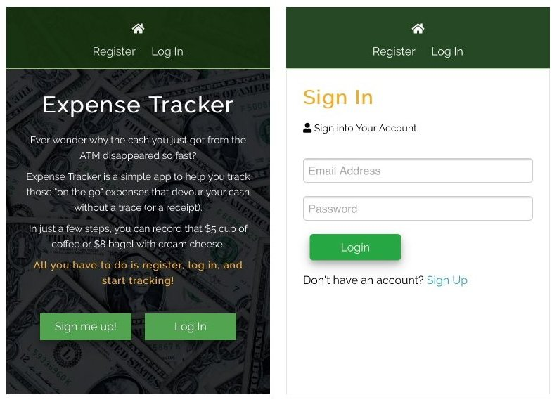
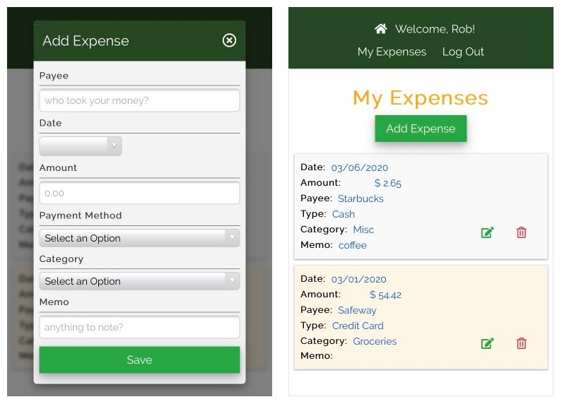

# Expense Tracker

_A web app to record misc expenses using React, Node and MongoDB._

View live on Heroku <a href="https://expense-tracker-0320.herokuapp.com/" target="_blank">HERE</a>.

## Summary
Expense Tracker is a single page application (SPA) that allows the user to keep track of misc expenses. They can log in and record where, when and how much was spent.  The user can also record a category, what method of payment was used, and a short memo. 

This project was my first experience with using MongoDB as a database. I really enjoyed working it. It was also my first time implementing user registration and login. I created my own in order to gain a better understanding of all the parts involved in authentication. (I will probably use a framework next time.) Since MongoDB makes implementing the database rather simple, most of the challenges I faced were in the front end with React. Managing persistant login state and protected routes became quite a challenge. Although my solution may not be the greatest, I learned a lot and will be trying alternate solutions on my next projects.

&nbsp;&nbsp; 
&nbsp;&nbsp;
&nbsp;&nbsp;
&nbsp;&nbsp;
&nbsp;&nbsp;
